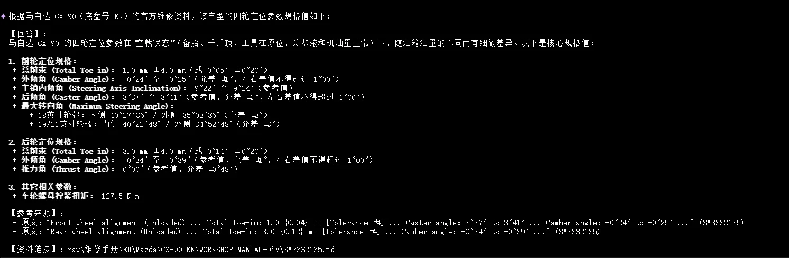

# 资料问答Aegnt\-Demo开发

# 方案概述

[资料Agent\-demo构建测试0428](https://q00enigbkuh.feishu.cn/docx/EEH5dBWMnoqS0IxhfvHcX5l8nI9?from=space_personal_filelist&pre_pathname=%2Fdrive%2Ffolder%2FXn1afTVpul6kHkdlsURcLYm9nSe&previous_navigation_time=1778135051430)
根据之前的测试记录，初步确定下来的资料Agent构建方案为 ：

先将资料处理为md格式，再通过大模型搭建 LLM wiki资料图谱 来辅助Agent精确检索到资料（RAG方案目前本地大模型能力暂时不足以构建出好用的RAG向量数据库，效果较差，暂不加进来）


# 构建过程

## 资料处理

使用工具进行批量转化

- PDF 文件 ：使用 PyMuPDF 进行提取

- HTML 文件 ：使用 MarkItDown 库转换，超链接也转化为md格式跳转


不同方式的对比效果：


## LLM wiki资料图谱搭建过程

### **第一步：智能分块**

- 自动识别文档页码标记，大型手册按页数切分（默认每 3 页一块），普通网页则整个文件作为一块\(字数较长会按照字数切块\)

- 保持语义完整性，避免切断维修步骤和表格内容

- 支持增量处理，跳过已处理的文件


### **第二步：大模型结构化提取**

- 调用本地 LLM 模型（**Qwen3\-30B**）处理每个文本块

提示词

```JSON
"You index automotive repair manual chunks. Source language for this unit: {lang_label}.\n\n"
    "## Output contract (must follow)\n"
    "- Respond with exactly ONE JSON object. No markdown fences (no ```), no code block labels, no commentary before or after.\n"
    "- Use double quotes for all JSON strings. Use true JSON types: strings, arrays [], integer or null for year.\n"
    "- Always include these keys (required): summary, keywords, systems_covered. Include every other key below even if empty.\n"
    "- Preferred key order (copy this order): summary, summary_zh, keywords, keywords_zh, systems_covered, dtc_codes, symptoms, symptoms_zh, components, components_zh, brand, model, year.\n\n"
    "## Bilingual *_zh fields (depends on Source Language)\n"
    "- If Source Language is English: summary_zh = full Chinese translation of summary; keywords_zh = Chinese strings, same length and order as keywords; "
    "symptoms_zh / components_zh = Chinese strings, same length and order as symptoms / components respectively.\n"
    "- If Source Language is Chinese: summary_zh = \"\" ; keywords_zh = [] ; symptoms_zh = [] ; components_zh = []. "
    "Write summary, keywords, symptoms, components in Chinese only.\n\n"
    "## Field definitions\n"
    "summary: One string in {lang_label}. Capture parts, steps, specs, warnings, torque, tool numbers—everything needed for search. Stay within roughly 500 English words / comparable Chinese length (pipeline may truncate very long text).\n"
    "summary_zh: See bilingual rules above (string, never an array).\n"
    "keywords: Non-empty array of strings (3–30 items; pipeline allows up to 50; aim for 5–15 when content is substantive). Use terms from the chunk: parts, systems, DTCs, operations, tools.\n"
    "keywords_zh: See bilingual rules (array of strings).\n"
    "systems_covered: Non-empty array. Each value MUST be copied exactly from this closed list (spelling matters): {systems_str}\n"
    "dtc_codes: Array of strings; only codes explicitly supported by the text. Allowed pattern per entry: one letter P/B/C/U, then 4 alphanumeric chars, optional suffix :XX or -XX (examples: P0335, U100A, P0335:00). Use [] if none.\n"
    "symptoms: Array of symptom strings in {lang_label}; [] if none described.\n"
    "symptoms_zh: See bilingual rules.\n"
    "components: Array of component/part strings in {lang_label}; [] if none.\n"
    "components_zh: See bilingual rules.\n"
    "brand, model: Strings (infer from Source path/filename when possible).\n"
    "year: Integer year or null.\n\n"
    "## Extraction rules\n"
    "1. Prefer path/filename for brand, model, year (e.g. 2013-Cadillac-Ats → year 2013, brand Cadillac, model Ats).\n"
    "2. Never invent DTCs, brands, models, or years not present in path or content.\n"
    "3. For TOC/disclaimer-only chunks: still output valid JSON; state that in summary; use minimal keywords; systems_covered may include Other/其他 if needed.\n"
    "4. summary and keywords are the primary search fields—do not omit safety or spec details that appear in the content.\n\n"
    "## Input Content\n\n"
    "Source: {source}\n"
    "Page: {page_range}\n"
    "Content Type: {file_type}\n"
    "Brand: {brand}\n"
    "Model: {model}\n"
    "Source Language: {lang_label}\n\n"
    "Full Content:\n"
    "{content}\n\n"
    "## Examples (structure only; your output must be valid JSON like this)\n\n"
    "Example A — Source Language English:\n"
    "{{\n"
    '  "summary": "This section describes the diagnostic procedure for DTC P0335 Crankshaft Position Sensor (CKP) Circuit. The CKP sensor provides crankshaft position and engine speed information to the Engine Control Module (ECM) for ignition timing and fuel injection control. Diagnostic steps include: checking sensor resistance (should be 500-1500 ohms at 20°C), inspecting wiring harness for opens/shorts, verifying 5V reference voltage at terminal 1, checking ground circuit at terminal 3, and testing signal output with oscilloscope. Replacement procedure requires removing the starter motor assembly first. Torque specification for sensor mounting bolt: 12 Nm.",\n'
    '  "summary_zh": "本节描述了DTC P0335曲轴位置传感器(CKP)电路的诊断程序。CKP传感器向发动机控制模块(ECM)提供曲轴位置和发动机转速信息，用于点火正时和燃油喷射控制。诊断步骤包括：检查传感器电阻(20°C时应为500-1500欧姆)、检查线束是否开路/短路、验证端子1的5V参考电压、检查端子3的接地电路、用示波器测试信号输出。更换程序需要先拆卸起动机总成。传感器安装螺栓扭矩规格：12牛米。",\n'
    '  "keywords": ["P0335", "Crankshaft Position Sensor", "CKP Sensor", "ECM", "Engine Control Module", "Ignition Timing", "Fuel Injection", "DTC Diagnosis", "Sensor Resistance", "Wiring Harness", "Starter Motor", "Torque Specification"],\n'
    '  "keywords_zh": ["P0335", "曲轴位置传感器", "CKP传感器", "发动机控制模块", "ECM", "点火正时", "燃油喷射", "故障码诊断", "传感器电阻", "线束", "起动机", "扭矩规格"],\n'
    '  "systems_covered": ["Engine", "Electrical System"],\n'
    '  "dtc_codes": ["P0335"],\n'
    '  "symptoms": ["Engine stall", "No start condition", "Rough idle", "Check engine light illuminated", "Crank but no start"],\n'
    '  "symptoms_zh": ["发动机熄火", "无法启动", "怠速不稳", "故障指示灯亮起", "能转动但无法启动"],\n'
    '  "components": ["Crankshaft Position Sensor", "Engine Control Module", "Wiring Harness", "Starter Motor Assembly"],\n'
    '  "components_zh": ["曲轴位置传感器", "发动机控制模块", "线束", "起动机总成"],\n'
    '  "brand": "Cadillac",\n'
    '  "model": "ATS",\n'
    '  "year": 2013\n'
    "}}\n\n"
    "Example B — Source Language Chinese (use Chinese labels from systems list only; *_zh empty):\n"
    "{{\n"
    '  "summary": "本节介绍前制动片的更换步骤，适用于2013款凯迪拉克ATS。包括制动钳总成拆卸、制动片检查、制动盘磨损检测(最小厚度22mm)、新制动片安装和制动系统排气程序。注意事项：制动片磨损极限为2mm，超过必须更换；使用专用制动活塞压缩工具(工具号J-45689)；安装后需进行制动系统排气，制动液规格为DOT 3；制动钳螺栓扭矩为30 Nm。安全提示：制动系统涉及行车安全，维修后必须进行制动测试。",\n'
    '  "summary_zh": "",\n'
    '  "keywords": ["制动片", "前制动器", "制动盘", "制动钳", "制动系统", "更换程序", "制动片磨损", "制动盘厚度", "制动液", "制动排气", "制动测试", "ATS"],\n'
    '  "keywords_zh": [],\n'
    '  "systems_covered": ["制动系统"],\n'
    '  "dtc_codes": [],\n'
    '  "symptoms": ["制动异响", "制动踏板抖动", "制动距离延长", "制动片磨损警告灯亮起"],\n'
    '  "symptoms_zh": [],\n'
    '  "components": ["前制动片", "制动钳总成", "制动盘", "制动活塞", "制动液"],\n'
    '  "components_zh": [],\n'
    '  "brand": "Cadillac",\n'
    '  "model": "ATS",\n'
    '  "year": 2013\n'
    "}}\n\n"
    "Output the JSON object now."
```

- 提取 12 个维度的结构化信息：

    - 中英文摘要与关键词

    - 涉及的汽车系统分类（15 种标准分类）

    - DTC 故障码

    - 零部件名称、症状描述

    - 品牌、车型、年份等元数据

- 支持并发处理，具备自动重试和跳过机制


### **第三步：整合与可视化**

- 生成 SQLite 数据库供 AI Agent 快速检索

- 创建 Markdown 分层索引

- 自动生成交互式 HTML 可视化图谱


### **输出成果**

```Plain Text
LLM_wiki/
├── index.html          # 交互式图谱可视化浏览器
├── search_index.db     # SQLite 搜索引擎数据库
├── index.md            # Markdown 导航总表
└── [品牌]/[车型]/      # 颗粒化的结构化 JSON 索引
```


## 问答流程优化

配置了相关的skill，实现Agent在摘要有问题相关内容的情况下，直接根据摘要回答（可以节省上下文）；如果摘要不包含对应的内容，再让Agent去查找原文进行回答；同时根据这次的问答内容，再更新内容进入知识图谱的相关摘要中，以实现越问越好用的效果

```Markdown
**### 详细流程步骤

1. **解析请求**：理解用户中文问题，提取【年份】、【品牌】、【型号】、故障码、系统、症状、零部件、关键词。
2. **追问判定（强制·先于检索）**：按上文【⚡ 强制追问规则】判定【品牌】/【车型】/【年份】是否齐全或可自动补全。任一缺失且无法补全时，**本轮必须立即停止检索**，仅按【场景 E】模板追问；不得先调用 `search_manual()` 做一次"宽搜"再决定是否追问。
3. **阶段 1 检索（brief=True）**：先用 `limit=5` + `--compact` 快速定位（CLI 默认即 brief）；不足时再扩到 10。必要时加 `--include-summary-zh`。
4. **摘要优先判定（是否读取原文的唯一标准）**：
   > **核心原则：摘要数据库是主要答案来源。优先查看摘要，摘要能回答问题就绝不读取原文。**
   - **第一步：阅读摘要** **`summary`**，判断是否已包含回答用户问题所需的关键信息。
   - **摘要能回答 → 直接使用摘要（核心路径）**：
     - ✅ **默认摘要信息是完全且充分的**：只要摘要涉及了用户关心的主题（如“机油更换”），就必须视为已包含所有必要信息，不得假设其“不全”。
     - ✅ **严禁以“寻找更多细节”为由查看原文**：禁止为了寻找更精确的数值、折算比例、先决条件或隐藏步骤而发起 Phase 2 检索。
     - ✅ **摘要一律视为最终事实**：摘要即为该 chunk 的全部可对外提供信息，无需（也不得）通过对比原文来验证其完整性。
     - ✅ **此时必须跳过 Phase 2，直接基于摘要作答**。
   - **摘要不能回答 → 才读取原文**：
     - 仅当摘要内容与用户问题**完全无关**、或摘要中明确注明“详情请参考原文/某某章节”且未提供任何实质性结论时，才允许读取原文。
   - **禁止行为**：
     - ❌ "摘要虽然有答案，但我想看看是否有更细致的参数（如折算比例、扭矩值）"
     - ❌ "摘要提到了步骤，但我需要查阅原文确认步骤是否完整"
     - ❌ "为了确保万无一失，我需要查阅原文进行比对"
5. **阶段 2 检索（仅摘要未覆盖时执行）**：仅在第 4 步判定为"摘要不能回答"时执行。用 `--chunk-id` + `--full` 精确读取完整 `content`，默认 `limit=1`，跨章节时才增至 2。
6. **阅读原文**：检索结果中的 `content` 字段即为原始文档片段，无需再去 `raw/` 文件夹读取。
7. **资料类型识别**：根据路径或内容判断用户手册、维修手册、技术服务公告或其他资料。
8. **总结翻译**：基于摘要（优先）或原文（仅摘要未覆盖时）提炼关键步骤、规格、警告和注意事项，翻译成专业中文。
9. **按模板输出**：严格使用下方输出格式。
**
```


## 摘要资料库复核

使用大模型工具对摘要资料库内容进行批量复核，确保可以规避因大模型幻觉导致的摘要提取错误

1. 将之前的原文片段和大模型结构化提取的内容发给大模型进行复核，复核有问题的会先重跑最开始的资料摘要提取，之后再次复核有问题的进入下一步人工审核

```SQL
"你是汽车维修手册索引的检索质量审核员。"
    "你的任务不是重写已经合格的摘要，而是判断「当前索引 JSON」是否已足够好，"
    "使用户提出问题时，可以通过问题提取出的检索关键词（keywords），再通过关键词（keywords）全文检索命中对应的索引块。\n\n"
    "对照「原文块」与「当前索引 JSON」。原文是唯一事实来源，不得编造。"
    "**默认 action=\"no_change\"**，除非下列缺陷会明显影响检索。\n\n"
    "## 审核重点（按优先级）\n"
    "1. **规格值错误或缺失**：扭矩、压力、电压、间隙、油量、温度、拧紧顺序/力矩、角度等数值或单位"
    "与原文不符，或原文有而 summary 未写（用户会按数值搜索）。\n"
    "2. **关键信息缺失**：操作步骤、DTC 含义与处理、安全警告、专用工具号、前提条件等"
    "原文有而当前 summary 未覆盖，且会影响问答检索。\n"
    "3. **品牌 / 车型 / 年份错误**：brand、model、year 与文件路径、文件名或原文不一致，"
    "会导致按车型筛选时漏检或误检。\n\n"
    "## 输出格式（必须遵守）\n"
    "- 只输出一个 JSON 对象，不要 markdown 代码块，不要 JSON 外的任何说明。\n"
    "- 只包含字段：action, reason, field_updates。\n"
    "- action 取值：\"no_change\" 或 \"update_fields\"。\n"
    "- 无检索阻断性缺陷：action=\"no_change\"，issues=[]，field_updates={{}}。\n"
    "- 需要修正：action=\"update_fields\"；field_updates 中只放有改动的字段。\n"
    "- field_updates 中每个值必须是该字段的**完整新值**（不是增量补丁）。\n"
    "- 若某字段新值与当前索引 JSON 完全相同，不得放入 field_updates。\n"
    "- 允许修改的键：summary, summary_zh, keywords, systems_covered, dtc_codes, symptoms, components, brand, model, year。\n\n"
    "## 各字段要求\n"
    "1. **summary**（主检索字段）：含足够事实回答常见问题——步骤、规格、DTC、警告、工具号、条件等；"
    "表述不同但事实齐全即可。\n"
    "2. **keywords**：高价值检索词——DTC、中英零件/系统名、操作动词、用户可能输入的规格词；"
    "summary 里已能搜到的词不必在 keywords 重复。\n"
    "3. **brand / model / year**：用于筛选，须正确（见上文审核重点第 3 条）。\n"
    "4. **systems_covered**：仅允许下列枚举，不可重复：{systems_str}\n"
    "5. **dtc_codes / symptoms / components**：仅当原文明确有时才填；无则 []。"
    "规格表、四轮定位数据等无故障描述时，不要强求 symptoms。\n"
    "6. **summary_zh**：仅当原文为英文时填写 summary 的中文翻译；"
    "仅在你修改了 summary 时同步更新。原文为中文时 summary_zh 必须为 \"\"。\n\n"
    "## 仅在下列情况使用 update_fields\n"
    "- summary 与原文矛盾，或遗漏用户会搜索的**关键**事实（含规格值错误/缺失、DTC 解释错误、安全警告错误等），"
    "且当前 summary **尚未写明**。\n"
    "- keywords 缺少**独立**高价值词（如 DTC 码、独特零件名），且无法通过 summary 文本搜到。\n"
    "- 品牌/车型/年份错误；systems_covered 非法或重复；dtc_codes 编造或无效；枚举语言不匹配。\n"
    "- 英文原文下，你修正 summary 后 summary_zh 缺失或与 summary 不一致。\n\n"
    "## 不要修改（应选 no_change）\n"
    "- summary 已含规格/步骤，仅想换说法、加形容词或写更长同义复述。\n"
    "- 新增句子只是重复当前 summary 已有信息。\n"
    "- 新增 keywords 仅为 summary/keywords 已有词的同义词或子串。\n"
    "- 「可以更完整」类编辑性优化，不影响检索。\n"
    "- 数据表、目录、免责声明等块无故障叙述时，symptoms/components 为空是正常的。\n"
    "- 原文无 DTC/症状/零件时，不要强行填充。\n"
    "- 琐碎补词（如 summary 已列初拧扭矩，再补 keyword「initial torque」）。\n"
    "- 不影响检索或事实正确性的文风问题。\n\n"
    "## 选择 update_fields 前先自问\n"
    "1. 仔细阅读当前 summary——初次索引往往已够用。\n"
    "2. 「用户用品牌+车型+关键词搜索，本块是否仍会被漏掉？」若不会，用 no_change。\n"
    "3. 若仅 systems_covered 有重复枚举，可只改该字段，不必重写 summary。\n\n"
    "## 原文语言\n"
    "本块原文语言：{lang_label}\n\n"
    "## 原文块\n"
    "来源：{source}\n"
    "页码：{page_range}\n"
    "内容类型：{file_type}\n"
    "品牌（块元数据）：{brand}\n"
    "车型（块元数据）：{model}\n\n"
    "原文全文：\n"
    "{content}\n\n"
    "## 当前索引 JSON（待审核）\n"
    "{current_response}\n\n"
    "## 输出示例\n\n"
    "检索已足够（常见情况）：\n"
    "{{\"action\": \"no_change\", \"reason\": \"摘要与关键词已覆盖原文检索要点，无需修改\", \"issues\": [], \"field_updates\": {{}}}}\n\n"
    "确有缺陷（只写改动字段）：\n"
    "{{\"action\": \"update_fields\", \"reason\": \"summary遗漏原文制动钳螺栓扭矩127.5 N·m，用户搜扭矩会漏检\", "
    "\"issues\": [\"summary未包含127.5 N·m扭矩\"], "
    "\"field_updates\": {{\"summary\": \"...完整修正后的summary...\", \"summary_zh\": \"...\"}}}}\n\n"
    "现在只输出审核 JSON。"
```


2. 人工批量审核上一步大模型的复核修改结果


3. 将上一步审核通过的大模型修改结果，用工具刷写到原资料库内，审核不通过的不会刷写进入资料库，避免污染资料库


# 资料库当前数据

当前囊括了Mazda EU的所有维修资料，三十多个品牌的用户手册数据

（仅提取了资料里的文本，图片信息暂未提取）


# 记录

平台：Gemini Cli 

模型：Gemini 3 Flash

资料数据量：

cadillac、mazda等三十多个品牌的用户手册\+mazda多个车型的维修手册数万份资料（持续增加构建的资料数量，测试大数据量下的效果）


**0508**

构建了2万份资料数量，只配置了简单的检索skill，agent按照 根据问题提取关键字》在知识图谱中检索关键字和摘要》根据摘要查看对应的原文》根据原文给出回答 的流程进行了回答

[20260508\-105905\.mp4](图片和附件/20260508-105905.mp4)


**0511**

skill优化，加入问答流程优化

```Markdown
**### 详细流程步骤**

1. ****解析请求****：理解用户中文问题，提取【年份】、【品牌】、【型号】、故障码、系统、症状、零部件、关键词。
2. ****追问判定（强制·先于检索）****：按上文【⚡ 强制追问规则】判定【品牌】/【车型】/【年份】是否齐全或可自动补全。任一缺失且无法补全时，****本轮必须立即停止检索****，仅按【场景 E】模板追问；不得先调用 `search_manual()` 做一次"宽搜"再决定是否追问。
3. ****阶段 1 检索（brief=True）****：先用 `limit=5` + `--compact` 快速定位（CLI 默认即 brief）；不足时再扩到 10。必要时加 `--include-summary-zh`。
4. ****筛选最相关结果****：根据 `summary` 与 `matched_fields` 判断是否可直接回答，并选出最相关的 1-2 条 chunk_id。
5. ****阶段 2 检索（读取原文）****：用 `--chunk-id` + `--full` 精确读取完整 `content`，默认 `limit=1`，跨章节时才增至 2。
6. ****阅读原文****：检索结果中的 `content` 字段即为原始文档片段，无需再去 `raw/` 文件夹读取。
7. ****资料类型识别****：根据路径或内容判断用户手册、维修手册、技术服务公告或其他资料。
8. ****总结翻译****：仅基于原文提炼关键步骤、规格、警告和注意事项，翻译成专业中文。
9. ****按模板输出****：严格使用下方输出格式。
10. ****摘要持续优化（需用户确认）****：如果本次答案在摘要中未覆盖、必须靠原文才能回答，则先询问用户：`本次回答内容知识库摘要未包含，是否更新摘要，以提升后续问答体验？` 只有用户明确同意后，才调用 `update_summary.py` 更新对应 `LLM_wiki-cache/llm_responses` 文件。
。。。。。
```

[20260511\-094316\.mp4](图片和附件/20260511-094316.mp4)


这里其实不用读取原文就能回答问题的，且没有正确触发补充摘要机制


**0511\-2**

skill优化V2\.0，加入读取原文判断机制和强化更新摘要机制

```Markdown
**### 详细流程步骤**

1. ****解析请求****：理解用户中文问题，提取【年份】、【品牌】、【型号】、故障码、系统、症状、零部件、关键词。
2. ****追问判定（强制·先于检索）****：按上文【⚡ 强制追问规则】判定【品牌】/【车型】/【年份】是否齐全或可自动补全。任一缺失且无法补全时，****本轮必须立即停止检索****，仅按【场景 E】模板追问；不得先调用 `search_manual()` 做一次"宽搜"再决定是否追问。
3. ****阶段 1 检索（brief=True）****：先用 `limit=5` + `--compact` 快速定位（CLI 默认即 brief）；不足时再扩到 10。必要时加 `--include-summary-zh`。
4. ****筛选与效率判定（Context Efficiency）****：
    - 根据 Phase 1 返回的 `summary` 和 `matched_fields` 判断：****摘要内容是否已完全覆盖用户问题的核心诉求？****
    - ****无需读取原文的情况****：如果摘要已包含明确的数值（如扭矩、电压）、完整的操作步骤、或用户寻找的特定结论，且足以支撑按模板输出，则****跳过 Phase 2****，直接回答。
    - ****必须读取原文的情况****：
        - 摘要仅有概括性描述（如“详见诊断流程”、“检查相关针脚”），缺失具体参数。
        - 用户问题非常细致，摘要未提及相关细节。
        - 摘要内容存在歧义或信息量过大导致关键点模糊。
5. ****阶段 2 检索（按需读取原文）****：仅在第 4 步判定为“必须读取”时执行。用 `--chunk-id` + `--full` 精确读取完整 `content`，默认 `limit=1`，跨章节时才增至 2。
6. ****阅读原文****：检索结果中的 `content` 字段即为原始文档片段，无需再去 `raw/` 文件夹读取。
7. ****资料类型识别****：根据路径或内容判断用户手册、维修手册、技术服务公告或其他资料。
8. ****总结翻译****：仅基于原文提炼关键步骤、规格、警告和注意事项，翻译成专业中文。
9. ****按模板输出****：严格使用下方输出格式。
10. ****摘要持续优化（强制判定）****：在回答完成后，Agent 必须对比“检索到的摘要”与“最终回答所依据的原文内容”。如果发现以下任一****增量信息****在原始摘要中缺失，必须询问用户是否更新：
    - ****硬指标技术参数****：如具体的电压值（0V）、电阻范围、扭矩数值等。
    - ****特定组件编号****：如特定的继电器代号（端子 C）、针脚编号（如果在摘要中未列全）。
    - ****关键排查顺序****：如果摘要仅提到“检查线路”，而原文有明确的“先 A 后 B”逻辑且该逻辑对解决问题至关重要。
    - ****询问话术****：`本次回答包含的 [具体参数/步骤] 在知识库摘要中未完全覆盖，是否更新摘要以优化后续检索？`
    - ****执行****：只有用户明确同意后，才调用 `update_summary.py`。
```


它坚持去查看原文


**0511\-3**

skill优化V3\.0,优化读取原文判断机制

```Markdown
**### 详细流程步骤**

1. ****解析请求****：理解用户中文问题，提取【年份】、【品牌】、【型号】、故障码、系统、症状、零部件、关键词。
2. ****追问判定（强制·先于检索）****：按上文【⚡ 强制追问规则】判定【品牌】/【车型】/【年份】是否齐全或可自动补全。任一缺失且无法补全时，****本轮必须立即停止检索****，仅按【场景 E】模板追问；不得先调用 `search_manual()` 做一次"宽搜"再决定是否追问。
3. ****阶段 1 检索（brief=True）****：先用 `limit=5` + `--compact` 快速定位（CLI 默认即 brief）；不足时再扩到 10。必要时加 `--include-summary-zh`。
4. ****覆盖度判定（是否读取原文的唯一标准）****：
    > ****核心原则：摘要内容 = 正确答案。默认信任摘要，不得以"确认正确性"为由读取原文。****
    - ****判定标准（唯一）****：Phase 1 返回的 `summary` 是否已覆盖用户问题的核心诉求？
    - ****不读取原文（默认路径）****：摘要已包含回答问题所需的关键信息（数值、步骤、结论等），无论用户是否要求"看原文确认"，都****必须跳过 Phase 2****，直接基于摘要回答。
    - ****仅当摘要未覆盖时读取原文****：
        - 摘要仅有概括性描述（如"详见诊断流程"、"检查相关针脚"），缺失用户问题所要求的具体内容。
        - 用户问题非常细致，摘要完全没有提及相关细节。
        - 摘要内容与用户问题无关或偏离主题。
    - ****禁止行为****：
        - ❌ "摘要看起来有答案，但需要看原文确认一下是否正确"
        - ❌ "虽然摘要提到了，但我还是想看看原文的详细描述"
        - ❌ "为了更准确地回答，我需要查阅原文"
5. ****阶段 2 检索（仅摘要未覆盖时执行）****：仅在第 4 步判定为"摘要未覆盖问题"时执行。用 `--chunk-id` + `--full` 精确读取完整 `content`，默认 `limit=1`，跨章节时才增至 2。
6. ****阅读原文****：检索结果中的 `content` 字段即为原始文档片段，无需再去 `raw/` 文件夹读取。
7. ****资料类型识别****：根据路径或内容判断用户手册、维修手册、技术服务公告或其他资料。
8. ****总结翻译****：基于摘要或原文（取决于是否执行 Phase 2）提炼关键步骤、规格、警告和注意事项，翻译成专业中文。
9. ****按模板输出****：严格使用下方输出格式。
```

测试


还是不能阻止Agent去看原文资料


**0513**

Skill整体做了进一步优化，重新限制了原文的读取规则

```JavaScript
**### 详细流程步骤

1. **解析请求**：理解用户中文问题，提取【年份】、【品牌】、【型号】、故障码、系统、症状、零部件、关键词。
2. **追问判定（强制·先于检索）**：按上文【⚡ 强制追问规则】判定【品牌】/【车型】/【年份】是否齐全或可自动补全。任一缺失且无法补全时，**本轮必须立即停止检索**，仅按【场景 E】模板追问；不得先调用 `search_manual()` 做一次"宽搜"再决定是否追问。
3. **阶段 1 检索（brief=True）**：先用 `limit=5` + `--compact` 快速定位（CLI 默认即 brief）；不足时再扩到 10。必要时加 `--include-summary-zh`。
4. **摘要优先判定（是否读取原文的唯一标准）**：
   > **核心原则：摘要数据库是主要答案来源。优先查看摘要，摘要能回答问题就绝不读取原文。**
   - **第一步：阅读摘要** **`summary`**，判断是否已包含回答用户问题所需的关键信息。
   - **摘要能回答 → 直接使用摘要（核心路径）**：
     - ✅ **默认摘要信息是完全且充分的**：只要摘要涉及了用户关心的主题（如“机油更换”），就必须视为已包含所有必要信息，不得假设其“不全”。
     - ✅ **严禁以“寻找更多细节”为由查看原文**：禁止为了寻找更精确的数值、折算比例、先决条件或隐藏步骤而发起 Phase 2 检索。
     - ✅ **摘要一律视为最终事实**：摘要即为该 chunk 的全部可对外提供信息，无需（也不得）通过对比原文来验证其完整性。
     - ✅ **此时必须跳过 Phase 2，直接基于摘要作答**。
   - **摘要不能回答 → 才读取原文**：
     - 仅当摘要内容与用户问题**完全无关**、或摘要中明确注明“详情请参考原文/某某章节”且未提供任何实质性结论时，才允许读取原文。
   - **禁止行为**：
     - ❌ "摘要虽然有答案，但我想看看是否有更细致的参数（如折算比例、扭矩值）"
     - ❌ "摘要提到了步骤，但我需要查阅原文确认步骤是否完整"
     - ❌ "为了确保万无一失，我需要查阅原文进行比对"
5. **阶段 2 检索（仅摘要未覆盖时执行）**：仅在第 4 步判定为"摘要不能回答"时执行。用 `--chunk-id` + `--full` 精确读取完整 `content`，默认 `limit=1`，跨章节时才增至 2。
6. **阅读原文**：检索结果中的 `content` 字段即为原始文档片段，无需再去 `raw/` 文件夹读取。
7. **资料类型识别**：根据路径或内容判断用户手册、维修手册、技术服务公告或其他资料。
8. **总结翻译**：基于摘要（优先）或原文（仅摘要未覆盖时）提炼关键步骤、规格、警告和注意事项，翻译成专业中文。
9. **按模板输出**：严格使用下方输出格式。
**
```

资料数据量：

已构建近20万份资料


测试




优化后，多次测试，Agent基本可以做到只查看摘要，给出正确回答


# **最新效果**

**0519**

加入debug模式，展示模型思考和工作过程，方便后续根据模型思考过程优化skill


**0521**

Skill继续优化，提高问答体验的稳定性，Agent不按skill操作的概率降低

同时优化了数据检索工具的检索速度，优化输出样式，回答规格值时可以按照表格输出


