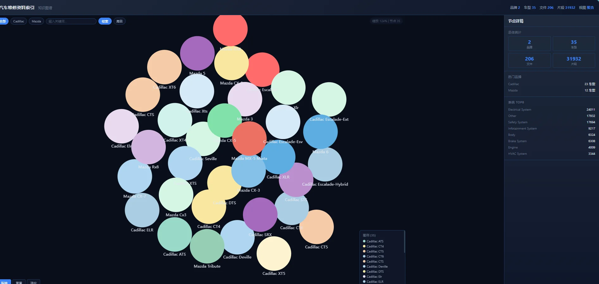
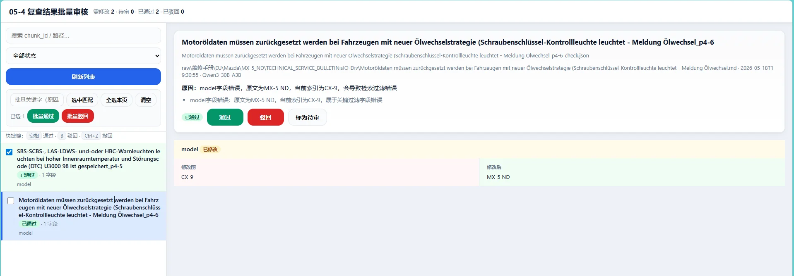
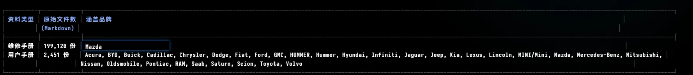
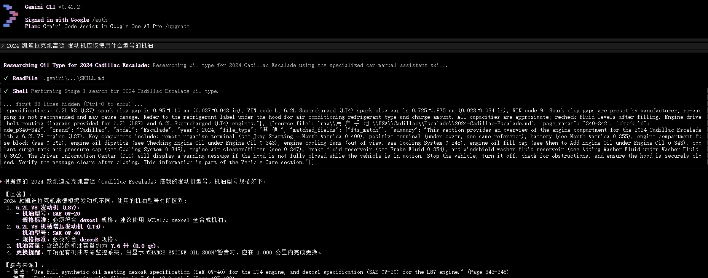
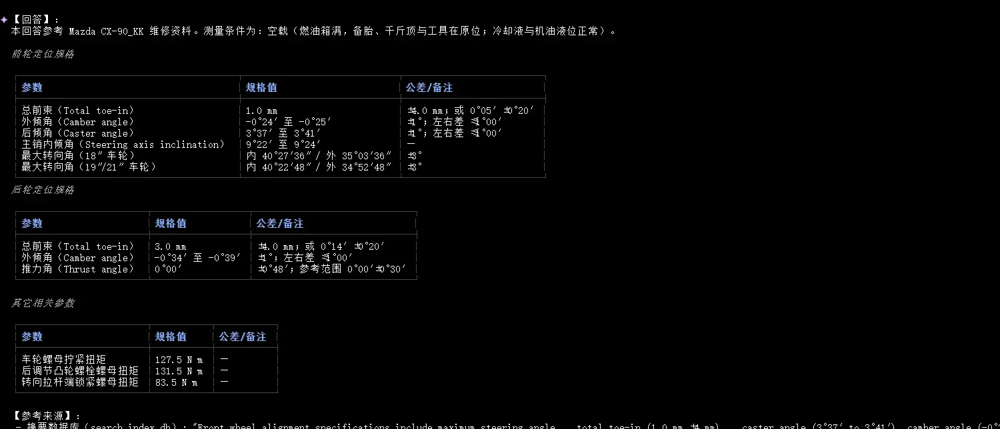

# 资料治理 Agent（知识库）· 开发手册

把海量汽车维修手册、用户手册治理成 Agent 可以精确检索的知识库：资料先经过结构化加工，再由问答 Agent 对接，用自然语言就能快速查到维修步骤、技术参数和故障码说明。

## 项目背景

汽车售后领域积累了海量的 PDF / HTML 手册资料——维修手册动辄上千页、品牌车型众多。人工查资料要在一堆文档里反复翻找，效率很低。

目标分两步：先把资料**治理**成结构化的知识库，再让问答 Agent 基于知识库回答问题，并且随着使用不断变得更好用。

## 方案选型：为什么不用向量 RAG

知识库检索常见的做法是向量 RAG（文本切片后做向量相似度检索）。实测后发现：**向量库的构建质量非常依赖嵌入模型能力，本地部署的模型构建出的向量库检索效果较差**，召回不准会直接拖垮问答质量。

最终采用的方案是「LLM Wiki 资料图谱」：

- 先用大模型把每份资料切片**结构化**——提取摘要、关键词、故障码、零部件等检索字段
- 检索走「关键词 + 摘要」的精确匹配路线，而不是向量相似度

好处是检索结果可解释（命中哪个词一目了然）、本地中等规模的模型就能胜任、检索速度快。

## 知识库构建流水线

构建分四步，全部支持增量运行——新增资料只处理增量部分。

**第一步：格式统一**

- PDF 文件用 PyMuPDF 提取文本
- HTML 文件用 MarkItDown 转换（超链接一并转为 Markdown 链接）
- 统一输出为 Markdown，便于后续处理

**第二步：智能分块**

- 自动识别文档页码标记，大型手册按页数切分（默认每 3 页一块），普通网页按字数切块
- 保持语义完整：避免切断维修步骤和表格内容
- 支持增量处理，自动跳过已处理的文件

**第三步：大模型结构化提取**

用本地部署的 Qwen3-30B 逐块提取 12 个维度的结构化信息：

- 中英双语摘要（覆盖部件、步骤、规格值、警告、扭矩、专用工具号等检索必需信息）与关键词
- 涉及的汽车系统分类（15 种标准分类）、DTC 故障码、症状描述、零部件名称
- 品牌、车型、年份等元数据（优先从文件路径推断，禁止编造）

流水线支持并发处理，带自动重试与跳过机制，稳定跑完数十万级资料。

**第四步：整合与可视化**

- 生成 SQLite 数据库，供 Agent 快速检索
- 创建 Markdown 分层索引
- 自动生成交互式 HTML 可视化图谱



最终的产出结构：

```text
LLM_wiki/
├── index.html          # 交互式图谱可视化浏览器
├── search_index.db     # SQLite 搜索引擎数据库
├── index.md            # Markdown 导航总表
└── [品牌]/[车型]/      # 颗粒化的结构化 JSON 索引
```

## 问答流程设计

问答 Agent 基于 Gemini CLI（Gemini 3 Flash）运行，通过自定义 Skill 编排检索工具与回答流程：

1. 解析请求：从用户问题中提取品牌、车型、年份、故障码、系统、症状、零部件、关键词
2. 追问判定：品牌 / 车型 / 年份不齐全且无法推断时，先追问再检索，避免宽搜浪费
3. 一级检索：在摘要库中按关键词快速定位（默认返回 5 条精简结果）
4. 摘要优先判定：**摘要能回答就绝不读取原文**——摘要视为该资料块的最终事实，禁止以「寻找更多细节」「确认正确性」为由扩大读取
5. 二级检索：仅当摘要确实未覆盖问题时，按块 ID 精确读取原文
6. 总结翻译：提炼关键步骤、规格、警告和注意事项，按固定模板用专业中文输出

「摘要优先」是整套流程的核心原则：多数问题在摘要层就能闭环，回答速度和上下文开销都大幅优化。

**越问越好用的自更新机制**：当某次回答确实超出了摘要覆盖（硬指标参数、特定组件编号、关键排查顺序等），Agent 会询问用户是否把新增内容更新进摘要库；确认后回写。知识库随着使用逐步变得更完整。

## 质量保障：摘要复核与防污染

结构化提取由大模型完成，难免出现幻觉或字段错误。摘要入库前设置了多道复核关卡：

1. **大模型批量复核**：把原文片段与提取结果一起交给复核模型，以原文为唯一事实，只修正会阻断检索的缺陷（规格值错误 / 缺失、关键信息遗漏、品牌车型年份错误等），无问题的默认跳过
2. **重跑提取**：复核判定有问题的块先重新执行结构化提取
3. **人工批量审核**：复核后仍有问题的进入人工审核，逐条通过 / 驳回
4. **防污染回写**：只有审核通过的修改才刷写进资料库，不通过的绝不落库



这样设计的目的：宁可多一道人工关卡，也不能让一条错误摘要污染整个知识库。

## 数据规模与效果



- 覆盖 33 个品牌的用户手册与多车型维修手册，累计近 20 万份资料、58 万+ 结构化切块，规模仍在持续扩充（用于验证大数据量下的检索表现）
- 目前仅提取文本信息，图片信息暂未纳入

经过多轮 Skill 迭代，问答 Agent 已能稳定遵循「摘要优先」流程给出正确回答；同时提供 debug 模式展示模型的思考与执行过程，便于持续调优。回答规格值类问题时支持按表格输出：





## 后续方向

- 提取资料中的图片信息，补全目前仅文本的能力边界
- 引入向量检索作为关键词检索的补充，覆盖语义相近但用词不同的提问
- 继续扩大资料规模，持续验证与优化大数据量下的检索速度与回答质量
