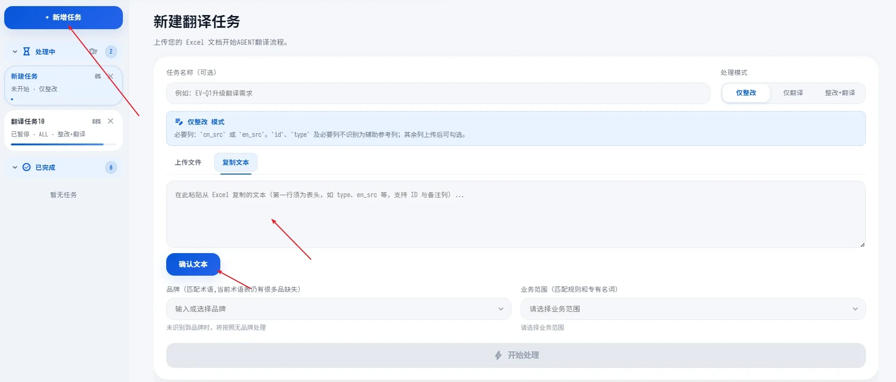
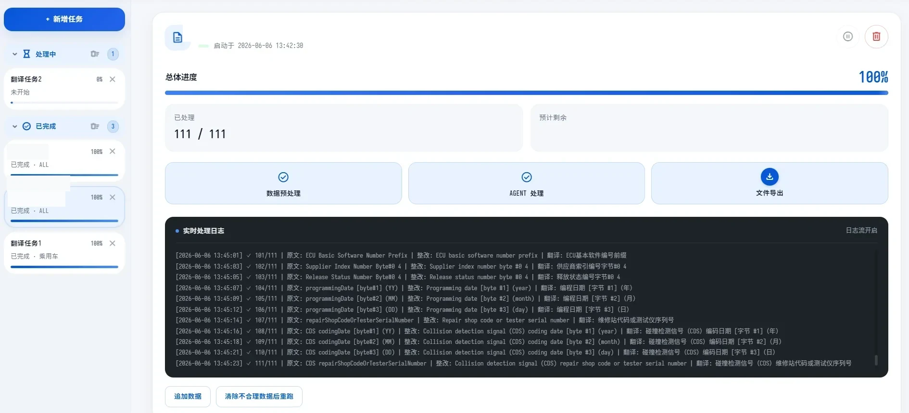
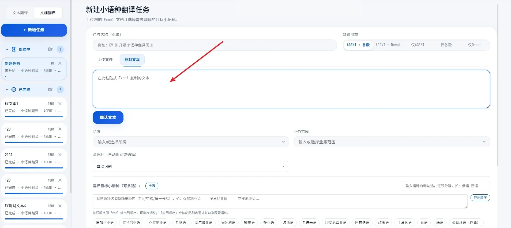
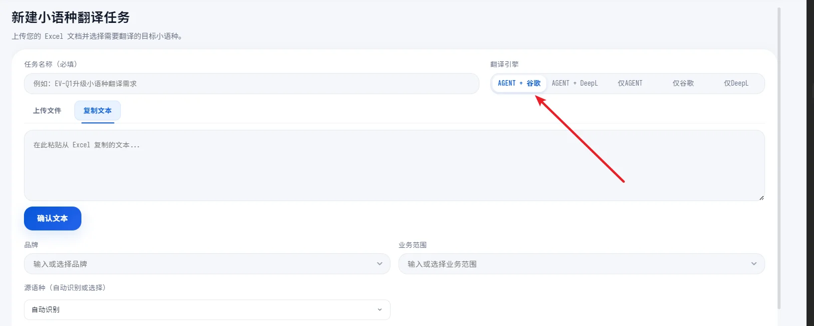
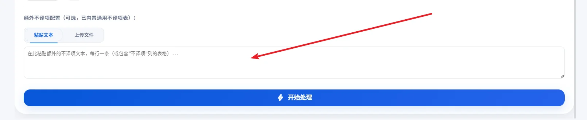

# 翻译 Agent 工具 · 开发手册

面向汽车技术翻译场景的 Agent 提效工具：把翻译中「有明确规则、重复量大」的整改与翻译工作交给 Agent 处理，译员从零散规则中解放出来，只负责最终把关。

## 项目背景

汽车技术文档的中英翻译里，有一类「整改 + 翻译」工作最耗时：文本量大、周期紧，且大部分修改遵循明确规则——固定表述怎么写、缩写对应什么全称、单位用什么写法、哪个词在哪个业务线怎么翻，都有据可依。

这类工作正好适合 Agent：**与其让大模型自由发挥，不如先帮它把「适用的规则」查出来，再让它带着规则干活。** 工具围绕这个思路设计，同时用本地部署的基座模型（Gemma4-31B-FP8）保证数据安全与成本可控。

## 整体设计

处理一条文本前，工具会先根据文本内容去各知识库检索相关规范，把命中的规则组装进上下文，再交给 Agent 生成结果：

- 待处理文本进入 → 智能检索六类知识数据，提取相关规则
- 命中的规则 + 待处理文本一起输入 Agent → 生成整改 / 翻译结果
- 结果按结构化文件导出，人工校验后即可进入下一环节

检索增强是整个工具的核心：模型只负责「按规范组织语言」，规范本身由检索保证一致性与可追溯。

## 接入的六类知识数据

- **历史翻译库**：从翻译历史数据库提取约 70 万条去重中英语料。对待处理文本做余弦相似度匹配，把最相近的历史译文作为参考交给 Agent，并支持定期增量更新。
- **翻译规则库**：把团队多年积累的改写规则整理成结构化的「触发条件 → 规范写法」。文本命中触发条件时，对应规则自动注入。
- **术语库**：汽车技术术语表。识别到缩写后自动检索对应全称；术语库优先级高于历史库提取结果。
- **单位规范**：各类度量衡单位的标准写法，识别到单位即触发。
- **产品线专用名词**：按业务线维护的中英互译规范，文本命中对应业务的专用名词时注入。
- **敏感词**：命中后对文本做颜色标记、提示人工把关，**不**自动改写——敏感词规则复杂，宁可保守处理。

## 平台功能与使用流程

工具以网页平台形式提供服务，分「中英整改翻译」与「小语种翻译」两个板块。

**中英整改翻译的使用流程：**

1. 新建任务：把要处理的内容粘贴进来（或上传 Excel）。首行为表头，工具自动识别 `cn_src` / `en_src` 作为待处理文本列，ID、type 等列自动作为辅助信息。
2. 选择处理模式：仅整改 / 仅翻译 / 整改+翻译。推荐先执行「仅整改」，人工校验修改后，再用整改后的文本执行「仅翻译」。
3. 选择品牌与业务范围：用于匹配对应术语和规则；没有覆盖到的可选「不限」。
4. 开始处理：任务完成后导出结果文件。

处理过程中可以实时查看逐条日志（原文 / 整改 / 翻译三段对照），完成后一键导出结果文件，整改依据与译文分列呈现，方便人工复核。

## 小语种翻译

小语种场景下，传统机器翻译常见的术语不统一、该保留的不译项被翻掉、风格生硬等问题很难解决。工具提供了独立的「小语种翻译」板块：

- **多语种批量处理**：自动识别源语种，目标语种可多选（30+ 种），输出列顺序可自定义。
- **翻译引擎自由组合**：Agent / 谷歌翻译 / DeepL 可任意搭配（如 Agent+谷歌、仅 DeepL），兼顾质量与速度。

- **系统的质量控制规则**，主要包括：
  - 母语级本地化：译文要自然流畅、避免翻译腔，符合维修技师 / 车主的阅读习惯
  - 不译项保留：品牌与车型名、行业标准缩写（ABS、ECU、BMS 等）、车内按键标签（A/C、START/STOP 等）、互联协议（CarPlay、CAN 等）、诊断代码与单位字母，均保持原文
  - 缩写镜像：源文「全称 (ABBR)」的结构在译文中原样保留，不增删、不压缩为纯缩写
  - 忠实源文：禁止增义，空格、换行、符号等格式原样保持
  - 参考信息只作参考：机器翻译参考译文、原厂语言文本仅用于把握语义，不盲抄
  - 特殊语言约束：如塞尔维亚语强制使用拉丁字母并使用标准带符字符

**不译项支持两级配置**：平台内置通用不译项表，项目可以额外粘贴 / 上传自己的不译项。

**辅助参考列**：上传内容时可附带原厂语言的参考列（如德语原厂文本），并在列名中说明参考方式，Agent 会将其作为理解原文的辅助信息，而非照抄对象。

## 规则的持续进化

规则库不是一次性建成的，工具设计了一条自我学习闭环：

- 把人工修改后的成稿（视为基本正确）与 Agent 的处理结果逐条对比，交给更强的模型（GPT-5.5 一级）总结差异规律
- 提炼出的新规则经内部评审后加入规则库，工具随之越用越准
- 规则难以穷举的部分，规划通过 LoRA 微调让基座模型在历史语料上深度学习，模仿译员的输出风格

## 成效与方向

- 翻译整改环节的效率与规范性显著提升，规则执行不再依赖个人记忆
- 后续方向：建立完整的术语收集体系持续扩充术语表、整合带编辑界面的翻译工具、增加成稿审校能力
