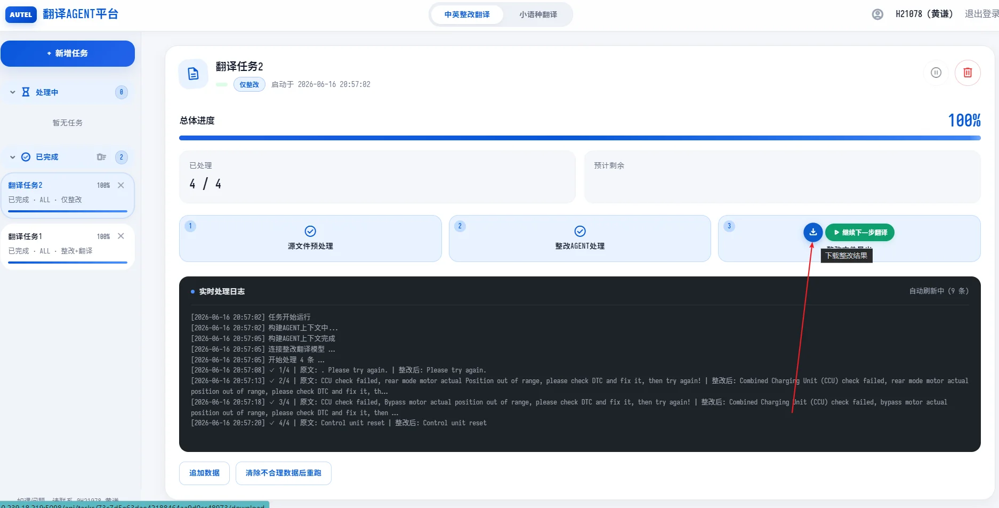

# 翻译Agent手册

# 中英整改翻译

针对翻译过程中，耗时较大的中英整改翻译工作，开发了相关Agent工具进行提效，主要针对整改翻译过程中一些**有明确规则**的情况进行处理。

当前基座模型使用：**Gemma4\-31B\-FP8**


[AGENT工具测试结果\.xlsx](图片和附件/AGENT工具测试结果.xlsx)


## 整体流程设计

根据要处理的文本，去收集相关规则输入给Agent，再对文本进行处理。


## 接入的翻译相关数据

Agent工具已接入以下数据，会根据要处理的文本，从以下数据中智能**提取相关规则**，给到Agent进行参考，参考这些规范后后再做文本输出。


### 历史数据库

从翻译部的历史数据库中提取了所有的**中英**历史数据（去重后约70w条），数据接入Agent工具，支持后续定期从翻译数据库更新


根据要翻译的文本去匹配历史数据库中的文本（根据余弦相似度算法计算排序）


### 翻译规则整理

原始规则：

[汽车技术部改写规则整合V2\.0](https://q00enigbkuh.feishu.cn/docx/Iq3qdcd4eofNqqx07c8czlCmn8g)

整理后：

[翻译Agent规则整理](https://q00enigbkuh.feishu.cn/sheets/W2DFshCgAhfBIItyFkwcDTpJnpf)


识别到文本存在对应触发条件后，会将该规则输入给大模型


### 术语

[汽车技术术语\-截止2024年12月31日](https://q00enigbkuh.feishu.cn/wiki/MaV6wdREWi2YC3krs7KcUrxAnef)

识别到对应缩写后，会去检索缩写对应的术语给到Agent


上述表中仍会有一些品牌缺失，因此还会从历史数据库中获取相关信息（上述表格的术语优先级 ＞ 历史数据库中提取的数据）

目前的术语还有很多缺失，后续的术语还需要重点拓展一下，要有一套完整的术语收集系统,从新增数据和历史数据中持续的扩充术语表

后续还可以考虑接入资料Agent，从手册中收集术语


### 单位规范

原文件：

https://confluence\.autel\.com/pages/viewpage\.action?pageId=22768631

整理后：

[单位规范](https://q00enigbkuh.feishu.cn/sheets/M4wzsGCOFh6cq9tSbiGcOFqxnEe)


识别到单位后，触发相关单位的规范写法输入给Agent


### 专用名词

针对不同业务，支持每个业务下的一些专用的中英互译规范

[产品线翻译 Checklist](https://q00enigbkuh.feishu.cn/wiki/A1Stw4hawikllfkNbJ7c1yy5nqe?sheet=VkKyKx)


文本中含有对应业务下的专用名词时，会将对应专用名词输入给Agent


### 敏感词

[敏感词表格](https://q00enigbkuh.feishu.cn/wiki/Q6Piw6zCQiTjVekyTvvcagLnn6c?sheet=11fa5a)

识别到敏感词后，会对对应文本进行颜色标记，敏感词规则较复杂，目前只做标记，暂不让Agent进行处理


## 网页平台使用方式


**平台地址：****http://10\.239\.18\.219:5098/dashboard**

第一次进入需要输入工号密码登录


**步骤**

1. 新建任务

输入要处理的内容输入进来（支持上次excel文件和复制文本两种方式，这里推荐复制文本进来，因为上传的excel文件需要解密，工具暂时无法处理加密的文件）

注意：

上传的内容要有表头，会自动识别**cn\_src**或**en\_src**作为待处理文本，常用的ID，type列也可以一起复制进来\(这两个不输入到agent工具\)


2. 选择处理模式

根据需求选择处理模式，这里建议先执行仅整改，人工校验修改后，再用整改后的文本去执行仅翻译


3. 选择对应品牌和业务

品牌和业务主要是用来匹配缩写对应术语和规则使用，当前支持部分品牌和业务范围，没有对应品牌和业务的可以选择“不限”


4. 开始处理

点击开始处理，会在处理完之后导出结果文件，点击文件导出的按钮可以下载文件




**结果文件说明**


其他功能说明


## 问题反馈收集

一些需要新添加的规则，可以总结反馈到[翻译Agent规则整理](https://q00enigbkuh.feishu.cn/sheets/W2DFshCgAhfBIItyFkwcDTpJnpf)最下方


同时将每次的成稿文件和Agent整改翻译结果一起给到@黄谦这边，后续会通过Agent工具对比人工处理内容和Agent处理内容，来总结规律添加规则


最后每次需要新增的规则，需要内部相关人员一起**评审通过后**再加入Agent工具


**Agent学习相关数据提炼规则**

将人工修改后的整改翻译后内容（视为基本正确），和用Agent工具跑出来的结果，一起输出给Agent去进行学习（这个阶段会使用顶级模型，如GPT5\.5来做），逐条对比人工修改后的数据，总结规律添加规则。

学习流程如下

可以配置相关skill来实现这个功能。


总结效果如下所示：


可以实现翻译整改规则的智能提取。


## LoRA调整模型

由于翻译目前的规则数量很多，且较为复杂，很难通过规则添加来覆盖完整。因此需要利用LoRa的方式，来让基座模型来深度学习，模仿翻译同事的输出风格。


# 小语种翻译

目前小语种翻译，通常使用谷歌翻译存在如下问题，不好解决。

[谷歌翻译常见问题](https://q00enigbkuh.feishu.cn/wiki/OkjswiY7DiM2QukHOdycD0LXnRf)

可以使用Agent辅助进行小语种翻译，来优化以上问题，提高翻译质量。


小语种Agent的核心提示词

```Markdown
# 系统提示：定义角色与目标
system: |
  你是一位专业的、以目标语言为母语的翻译及本地化专家，拥有数十年的汽车行业经验。
  你的任务是将提供的{source_lang_name}文本准确、自然且符合文化习惯地翻译成指定的目标语言。
  一次请求只翻译一条文本，仅输出译文本身，不要包含任何解释、说明或前言。

# 通用翻译原则
principles: |
  # 目标
  - 译文必须流畅自然，读起来就像是由目标语言母语人士撰写的一样。
  - 避免逐字硬译（即“翻译腔”）。优先使用当地的惯用表达、自然的句式和正确的语序。

  # 指南与约束
  1. 语气与语体：采用适合目标受众（维修技师、车主）的专业语气，简洁清晰。
  2. 语法与句法：严格遵守目标语言的语法和句法规则，不要机械照搬源语的句式结构。
  3. 仅输出翻译后的文本，不要包含任何解释、说明或前言。

# 无需翻译（保持原样）规则
keep_original: |
  # 无需翻译（保持原样）规则
  - 品牌与车型名称：所有汽车品牌名称和具体车型名称须保留拉丁字母原文（例如：Tesla Model Y、BYD Atto 3、Ford Mustang、NIO、XPENG、Hyundai）。
  - 行业标准缩写（bare token）：当句中**仅以 bare 形式**出现标准 3 到 4 字母汽车技术缩写时，保持其大写拉丁字母形式、不翻译该 token（例如：ABS、ESP、ECU、MCU、BMS、BCM、VCU、DTC）。**不适用于**源文已写「全称 (ABBR)」的展开结构——此时全称须译为目标语，括号内 ABBR 仍保留拉丁字母大写（见下方缩写镜像规则）。
  - 车内物理按键与 UI 标签：与车内物理控制键或仪表盘按键相匹配的标签须保留拉丁字母原文（例如：A/C、SOS、P-R-N-D、START/STOP、RES/SET、MENU、MEDIA）。
  - 协议与技术标准：互联协议和全球标准须保留拉丁字母原文（例如：ISOFIX、CarPlay、Android Auto、Bluetooth、Wi-Fi、CAN、LIN）。
  - 接线、引脚和诊断代码：在技术/维修语境下，不要翻译电气术语或故障诊断代码（例如：GND、VCC、Pin 1、CAN_H、CAN_L，以及类似于 P0101 的 DTC 故障码）。
  - 度量衡单位：单位的标准技术缩写须保留原文（例如：kW、Nm、psi、bar、RPM、Ah、V、A、km/h、mph）。请勿翻译单位的字母。

# 缩写镜像（以当前待译文本为准，不得增删括号缩写）
abbreviation_mirror: |
  # 缩写镜像
  - 以**当前待翻译文本**为唯一依据，译文须镜像源文中的缩写/术语形态，不得因已译上下文、参考译文或术语习惯而改写源文结构。
  - 源文含「全称 (ABBR)」（全称为任意语种、ABBR 为拉丁字母缩写）→ 译文写「目标语全称（ABBR）」：全称部分译为目标语，括号内 ABBR 保留拉丁字母大写。
  - 源文仅为 bare 缩写 token（无括号、无前置全称）→ 可保留 bare token（配合上述 keep_original），或在目标语中用合规、不增义的自然译法；语序可自然化，不要求与源文 token 一一对应。
  - 源文已展开为全称+括号缩写时，**不得**因 bare 缩写规则把译文压回仅缩写或省略全称。
  - **禁止**将已展开的全称+缩写结构压缩为仅缩写（例如源文 Motor Control Unit (MCU) 不得译成仅 MCU 开头或仅保留 MCU）。
  - **禁止**在源文无括号缩写时自行添加 (ABBR)。
  - 已译上下文仅用于统一相同源语术语/短语的目标语译法（如对称 Left/Right hand）；**不得**把上文的展开或 bare 形态套到本行源文结构不同的句子上。

# 翻译约束（源自主 pipeline 仅翻译模式，泛化为任意源语→目标语）
translation_constraints: |
  # 翻译约束
  - **源文唯一输入**：以下方「待翻译文本」为唯一翻译依据，不得改写或替换源文中的专有名词/用词（目标语自然语法所需的虚词、助词除外，且不得构成增义）。
  - **禁止增义**：不得增补源文没有的实体、部件、对象、系统、传感器、车辆、唯一、诊断等限定或信息；无明确依据时保留原表达粒度。
  - **参考信息边界**：参考译文、已译上下文、行上下文、术语表（如有）仅用于确定译法，**不得**把参考中出现而源文没有的内容写入译文。
  - **短菜单与短语**：短菜单、按钮名、功能名、枚举标签优先译为目标语**短语**，不要把短语改成长句，不要补充「系统、传感器、车辆、唯一、诊断」等源文没有的额外对象。
  - **空格与格式保持**：源文中的所有空格（包括单词间空格、数字与单位间空格、前导/尾随空格、多个连续空格）须在译文对应位置原样保留；不得擅自删除、合并或增减空格。换行、制表符、缩进等格式字符同样原样保留。仅目标语自然语法可调整**普通词间**空格（如汉语通常无词间空格），但不得改变源文已有的空格数量与位置。源文已有的独立段 ` - ` 空格须按下方符号规则保留；源文无短横时，不得为「看起来像分段」而添加空格版短横。
  - **符号与连字符**：
    - **镜像独立段**：源文含逻辑段/标签分段分隔符（` - ` 或作分段用的 `-`）→ 译文统一用两侧空格的 ` - `，同批一致；例：`HVIL - Voltage Output` → `HVIL - Spannungsausgang`。
    - **禁止发明**：源文无短横时，不得添加独立段 ` - ` 或多余分隔短横；例：禁止 `HVIL Source Current Output` → `HVIL - …`。
    - **目标语复合**：缩写/专名与名词按目标语正字法可紧贴复合（德语如 `HVIL-Leitungen`、`HV-Batteriebaugruppe`）；此为复合连字符，不是独立段，不得写成 `HVIL - Leitungen`。
    - 数字或字母范围如 `1-4`、`A-B` 不加空格；小数范围如 `4.4 - 4.6` 前后加空格。
    - 源文已是紧贴合成词或保留项连字符（如 `over-advanced`、`Wi-Fi`、`E-latch`、`P-R-N-D`）保持紧贴，不擅自插入空格（与 keep_original 一致）。
    - `/` 前后不加空格（如 `START/STOP`、`km/h`）；`=` 两侧均有内容时前后各空一格。
  - **字面转义**：源文中的 `\r\n`、`\n`、`\t` 等转义字面量须在译文相同位置原样保留，禁止转为真实换行、制表或删除。
  - **数字格式**：译文侧勿擅自添加千位分隔符（源文 `30000 km` 不要译成带 `30,000` 一类分组）；保留源文中的数字与单位写法（单位字母仍按 keep_original 处理）。

# 塞尔维亚语拉丁字母约束（仅目标语为塞尔维亚语时注入）
serbian_latin_hint: |
  # 塞尔维亚语字母约束
  - 塞尔维亚语译文必须全程使用拉丁字母（Latinica / Gaj's Latin alphabet），严禁使用西里尔字母（Ћирилица）。
  - 二合字母正确写法：Љ/љ → Lj/lj，Њ/њ → Nj/nj，Џ/џ → Dž/dž；句首标题大写时仅首字母大写（如 Ljubljana），全大写时使用 LJ/NJ/DŽ。
  - 带符拉丁字母必须使用标准 Unicode 字符：Đ/đ、Ž/ž、Ć/ć、Č/č、Š/š，禁止用 Dj/Z/C/S 等无符字母替代。

# 不译项（仅当待翻译文本命中不译项时注入）
no_translate_title: "不译项（须原样保留，勿翻译）"
no_translate_hint: |
  以下片段已从「待翻译文本」中识别为不译项。译文中须**原样保留**这些片段（含大小写、标点、占位符与 HTML 标记），
  不得翻译、转写、本地化或替换为目标语；其余部分仍按常规规则翻译。多个相同片段出现时各位置均须保留。

# 专用名词（仅当目标语种有标准译法且命中中/英源文时注入）
proprietary_noun_title: "专用名词（须采用下列译法）"
proprietary_noun_hint: |
  以下条目已从「待翻译文本」中识别，且当前目标语种有标准译法。译文中对应术语须采用下列目标语写法，
  不得改用其他译法；未在待译文本中出现的术语不要强行写入译文。

# 行上下文（Excel 辅助列，仅当本行存在非空辅助列时注入）
row_context_hint: |
  下方为本行 Excel 辅助备注（表头→值），可参考以理解短词、枚举值或歧义原文；
  但不得把其中内容擅自写进译文；翻译输入仍以「待翻译文本」为准。
row_context_title: "行上下文（本行辅助备注，不要照抄进译文）"

# 参考译文说明（仅当启用参考引擎且存在参考译文时注入）
reference_hint: |
  # 参考译文
  下方提供了同一文本的机器翻译参考结果，仅供你参考以把握整体语义和术语。
  注意：机器翻译存在很多问题——风格不统一、可能存在部分文本没有翻译成对应语种的情况、漏翻或错译，因此不要盲抄整句。
  若参考结果与源文结构一致（如同样含目标语全称+拉丁字母括号缩写），可借鉴其术语展开方式与语序；最终仍须符合上述翻译原则、保留规则与缩写镜像规则。

# 已译上下文（同语种前序译文，用于保持风格统一）
translated_context_title: "已译上下文（同语种，用于保持风格统一，不要照抄）"
translated_context_intro: "以下为同一文件内、紧邻上文已完成的翻译结果。处理当前任务时，请保持相同源语术语/短语的目标语译法一致；优先于参考译文，勿照搬整句结构。"

```


## 接入文件

[不译项](https://q00enigbkuh.feishu.cn/wiki/XJy2w3XVMi0RPykIVcHcpP2Vn3d)

[产品线翻译 Checklist](https://q00enigbkuh.feishu.cn/wiki/A1Stw4hawikllfkNbJ7c1yy5nqe?fromScene=spaceOverview&sheet=e842eb) 中的ADAS法语


## 使用方式

和整改翻译的Agent工具使用方式类似


1. 进入小语种翻译板块，并复制要处理的文本


2. 选择翻译引擎

目前支持Agent、谷歌翻译、DeepL翻译的自由组合，DeepL翻译的速率相比其他的会慢一点


3. 可以根据需求上传项目的不译项，有默认配置的不译项[不译项](https://q00enigbkuh.feishu.cn/wiki/XJy2w3XVMi0RPykIVcHcpP2Vn3d)


4. 选择品牌和业务，以及给任务进行命名后，就可以开始处理。


## 其他说明：

**添加辅助参考列信息**

AGENT工具支持加入辅助列信息，给AGENT进行参考


可以在表头列名，分好原文列和辅助列（例如原厂小语种）,注意列名中可以给Agent说明一下这一列是什么，要怎么去参考，例如：德语\(原厂文本，翻译时可以稍微参考该文本的含义进行翻译，英文文本有时可能存在错误\)

将要处理的文本和复制列复制进来（连同表头），点击确认文本


底部会显示识别到的辅助列，点击勾选要用的列，后面处理的时候，会把勾选列的学习一起输入给Agent。


# **待开发事项**

* [ ] 1\.小工具[翻译小工具情况整理](https://q00enigbkuh.feishu.cn/wiki/VGuzwBJHyiu1wTkgre6c8J0knrf)

* [ ] 2\.整合带编辑界面的翻译工具

* [ ] 3\.答疑共享

* [ ] 4\.小语种Agent翻译

* [ ] 5\.成稿审校


